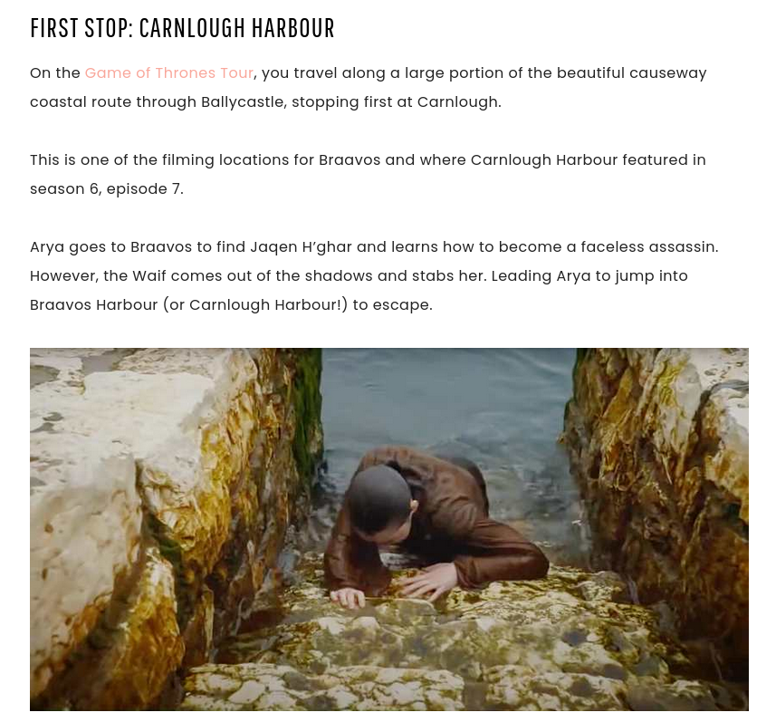
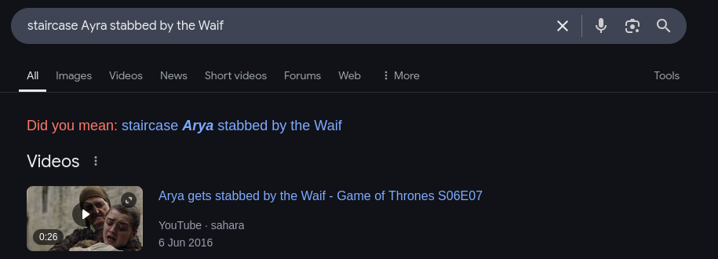

# Solution pour le challenge Lab Of Thrones

## Analyse de l'image

Sur l'image on remarque rapidement un drapeau irlandais, et des collines verdoyantes dans le fond de l'image. On remarque également quelques commerces. En zoomant sur l'image on peut trouver le nom de 2 d'entre eux.

## Utilisation de Google Images

lorsque l'on upload l'image sur Google Images, de nombreux résultats font référence à la série HBO Game of Thrones. Le nom de l'image contenant HBO nous confirme que nous sommes sur la bonne piste.

## Trouver le lien <https://www.footstepsontheglobe.com/destinations/europe/uk/northern-ireland/where-to-find-the-most-epic-game-of-thrones-locations-in-northern-ireland/>

Ce lien décrit un tour de l'Irlande du nord qui passe par de nombreux endroits ayant servi à filmer des scènes de la série.

Les nombreuses références au port de Carnlough permettent de recroiser l'information avec le texte:

> First stop: Carnlough Harbour
> On the Game of Thrones Tour, you travel along a large portion of the beautiful causeway coastal route through Ballycastle, stopping first at Carnlough.
> This is one of the filming locations for Braavos and where Carnlough Harbour featured in season 6, episode 7.
> Arya goes to Braavos to find Jaqen H’ghar and learns how to become a faceless assassin. However, the Waif comes out of the shadows and stabs her. Leading Arya to jump into Braavos Harbour (or Carnlough Harbour!) to escape.

L'épisode 7 de la saison 6 y est directement mentionné: `LABO{S6E7}`.

## Alternative, grâce à la localisation

<https://www.objetivopangea.es/post/lugares-que-ver-en-irlanda-del-norte>

Les nombreuses images qui apparaissent font référence à la ville de Carnlough (Irlande du Nord) et à la série Game of Thrones. Une recherche Google `Carnlough Game of Thrones`

<https://www.ballygallycastlehotel.com/game-of-thrones-filming-locations/>

Ce lien décrit la scène suivante:

> This picturesque harbour was home to a critical Braavos-based scene from season six. The stony staircase leading down to the sea were the steps Ayra crawled up after being stabbed by the troublesome Waif.

Une dernière recherche Google nous permet de confirmer l'épisode.

