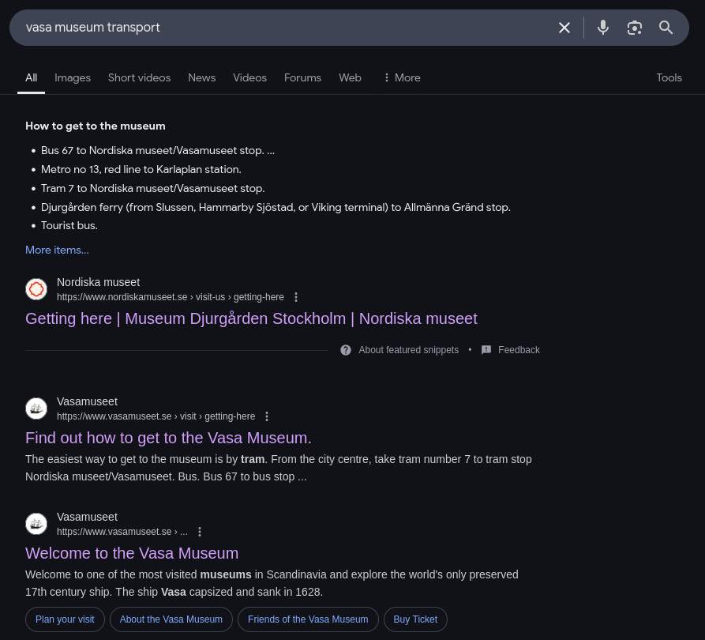

# Solution: Ça va être tout noir

## Analyse de l'image

Sur l'image, on ne voit pas grand chose. Cela pourrait ressembler à un bateau en éclairant un peu l'image.

### Google Images

En uploadant la photo sur Google Images, les premiers résultats font référence à un bateau, ce qui confirme nos suspicions:

#### Flickr

Beaucoup d'images sont sur flickr, un réseau social de partage d'albums photos.

Sur ces photos de vacances, beaucoup de ces albums sont des vacances en Suède / dans des pays Scandinaves qui nous permettent de limiter le rayon de la recherche à quelques pays.

### Localisation de la photo

Plusieurs résultats de la recherche Google nous donnent plus de précisions sur l'emplacement de ce bateau:

Ces sources évoquent le Vasa-Museet (musée Vasa en Suédois).

## Analyse de l'audio

### Détection de la langue, attention

Certains traducteurs reconnaissent le langage comme du norvégien. Le norvégien est une langue très proche du suédois et partage de nombreux mots et éléments grammaticaux. Cela peut induire en erreur et laisser penser que l'image est en Norvège.

### Analyse de l'audio et traduction

Le fichier audio ([message vocal](../sources/voice_message.wav)) est un enregistrement en suédois. Une transcription speech-to-text (<https://www.speech-to-text.cloud/>) nous permet de récupérer le contenu de l'audio afin de le traduire:

> [00:00:00 - 00:00:02] Hej älskling!
> [00:00:02 - 00:00:05] Jag har ungefär 41 minuter kvar med transfen.
> [00:00:05 - 00:00:09] Det är sex stopp så jag borde vara på hotellet om mindre än en timme.
> [00:00:09 - 00:00:12] Jag hoppas bara att jag inte blir sjösjuk som imorse.
> [00:00:12 - 00:00:16] Besöket gick bra och jag längtar efter att visa dig bilderna.
> [00:00:16 - 00:00:20] Men jag är rädd att de inte är av så bra kvalitet på grund av ljuset haha.

Qui nous donne, une fois traduit:

> Bonjour chérie !
> Il me reste environ 41 minutes de transfert.
> Il y a six arrêts donc je devrais être à l'hôtel dans moins d'une heure.
> J'espère juste que je n'aurai pas le mal de mer comme ce matin.
> La visite s'est bien passée et j'ai hâte de vous montrer les photos.
> Mais j'ai peur qu'ils ne soient pas d'une si bonne qualité à cause de la lumière haha.

-> plusieurs informations sont à retenir dans ce audio:

- Il reste 41 minutes de transport à Paul
- Il a 6 arrêts avant d'arriver vers son hôtel
- Il avait le mal de mer ce matin (est-ce à cause du transport?)
- Il parle d'une visite

La visite confirme qu'il était dans un musée (comme évoqué plus haut).

Le mal de mer nous donnera une indication sur les différents transports qui existent à Stockholm.

## Analyse des informations récoltées

Nous connaissons le point de départ de Paul (Vasa-Museet) et savons que son son arrivée à l'hôtel sera dans moins d'une heure. Il aura 41 minutes de transfert (mauvaise traduction?). Il aura 6 arrêts au cours de ce déplacement.

Ainsi, nous raisonnons à l'envers en cherchant les transports qui existent à proximité du musée Vasa:

Recherche Google: `vasa museum transport`

<https://www.vasamuseet.se/en/visit/getting-here>

On y trouve de nombreux moyens de transport, mais seul l'un d'entre eux est susceptible de provoquer le mal de mer, le Ferry.

Seuls 3 ferries circulent et desservent le musée (à l'arrêt Allmänna gränd).

### Déterminer le ferry

#### Ligne 82: Slussen–Allmänna gränd–Skeppsholmen–Slussen

<https://kund.printhuset-sthlm.se/sl/s82.pdf>

On remarque sur cette ligne que seuls 4 arrêts sont desservis (le message vocal fait mention de 6 arrêts).

Ça ne peut pas être cette ligne.

#### Ligne 80

<https://kund.printhuset-sthlm.se/sl/h80.pdf>

Cette ligne dessert 10 arrêts et s'arrête à proximité du musée (Allmänna gränd).

#### Ligne M/S Emelie

<https://ressel.se/en/emelie-traffic/>

En observant les arrêts desservis, cette ligne ne dessert plus le musée (en 2025).

Aussi, le nombre d'arrêts est 6, ce qui empêche de descendre après 6 arrêts (même en montant dans le ferry au premier arrêt et en descendant au terminus, on descend après seulement 5 arrêts).

### Suivre la ligne 80

En montant à `Allmänna gränd` et en descendant après 6 arrêts, on descendrait à `Lidingö/Dalénum`.

## Trouver l'hôtel

En zoomant sur `Lidingö/Dalénum`, puis en faisant une recherche d'hôtel, un seul résultat est disponible: Boo Boo Living (<https://maps.app.goo.gl/p8bNCTaiKYhvoqJn8>)

## Flag

`LABO{Boo_Boo_Living}`
