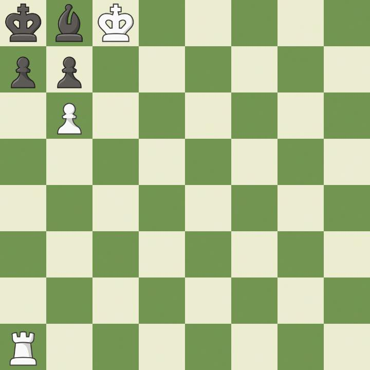

# InChessCeption

## Auteur: dryy

## Difficulté: Moyen

## Description

Le professeur Paul Morphenstein, un brillant mais excentrique scientifique, a disparu dans des circonstances mystérieuses. Son laboratoire, autrefois un temple du savoir, est aujourd’hui plongé dans le chaos. Parmi ses notes griffonnées à la hâte et ses expériences inachevées, une étrange image est retrouvée sur son bureau.

Les rumeurs disent que Stein travaillait sur une intelligence artificielle révolutionnaire spécialisée dans les échecs, mais qu'il aurait découvert quelque chose d’inquiétant… avant de disparaître.

Saurez-vous percer le secret de cette image et retrouver ce que le professeur a laissé derrière lui ?

