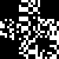

# Quick XOResponse

Quick XOResponse is a challenge where two sources are given. Both are a black and white image.

The title gives us an indication, as it is composed of the words Quick Response and XOR.

## Examining the files

```bash
file *.png
# fake.png: PNG image data, 75 x 75, 1-bit colormap, non-interlaced
# key.png:  PNG image data, 75 x 75, 1-bit grayscale, non-interlaced
```

Both files are a 75*75 png picture. Both use a 1-bit color map.
The files are quite small (less than 400 bytes).

```bash
exiftool *.png
======== fake.png
ExifTool Version Number         : 12.57
File Name                       : fake.png
Directory                       : .
File Size                       : 328 bytes
File Modification Date/Time     : 2025:04:20 13:47:11+02:00
File Access Date/Time           : 2025:04:20 13:47:43+02:00
File Inode Change Date/Time     : 2025:04:20 13:47:11+02:00
File Permissions                : -rw-r--r--
File Type                       : PNG
File Type Extension             : png
MIME Type                       : image/png
Image Width                     : 75
Image Height                    : 75
Bit Depth                       : 1
Color Type                      : Palette
Compression                     : Deflate/Inflate
Filter                          : Adaptive
Interlace                       : Noninterlaced
Palette                         : (Binary data 6 bytes, use -b option to extract)
Transparency                    : 255 255
Pixels Per Unit X               : 2834
Pixels Per Unit Y               : 2834
Pixel Units                     : meters
Image Size                      : 75x75
Megapixels                      : 0.006
======== key.png
ExifTool Version Number         : 12.57
File Name                       : key.png
Directory                       : .
File Size                       : 259 bytes
File Modification Date/Time     : 2025:04:20 13:47:11+02:00
File Access Date/Time           : 2025:04:20 13:47:43+02:00
File Inode Change Date/Time     : 2025:04:20 13:47:11+02:00
File Permissions                : -rw-r--r--
File Type                       : PNG
File Type Extension             : png
MIME Type                       : image/png
Image Width                     : 75
Image Height                    : 75
Bit Depth                       : 1
Color Type                      : Grayscale
Compression                     : Deflate/Inflate
Filter                          : Adaptive
Interlace                       : Noninterlaced
Image Size                      : 75x75
Megapixels                      : 0.006
    2 image files read
```

Exiftool does not give us any more information.

## Observing the files

### fake.png examination

[The first file, fake.png](../fake.png) is a QR code.

.

Let's scan it to see which data it contains!

```bash
zbarimg fake.png 
QR-Code:FAKE{it's_not_the_flag}
scanned 1 barcode symbols from 1 images in 0 seconds
```

> FAKE{it's_not_the_flag}

Obviously, the challenge should not be this easy. But it's (kinda?) promising.

### key.png

[The second file, key.png](../key.png) is weird.



We notice it looks like a QR-code: the top-left, top-right and bottom-left corners are black squares, and the rest of the picture looks like [Gaussian noise](https://en.wikipedia.org/wiki/Gaussian_noise)

## Tying the hints together

The images have been XORed together.

Use a tool that may XOR 2 images together to obtain a resulting QR code.

### Using GIMP

1. Open **GIMP**
2. Open both files **as Layers** (CTRL+ALT+O)
3. In the **Layers panel**, select the **Difference** Mode
4. Scan the QR code, it should contain the flag!

### Using Python

See [solve.py](./solve.py).

## Bonus: scan an image in CLI

```bash
zbarimg flag.png
# QR-Code:LABO{X0R1n6_QR_c0d3s?!}
# scanned 1 barcode symbols from 1 images in 0 seconds
```
